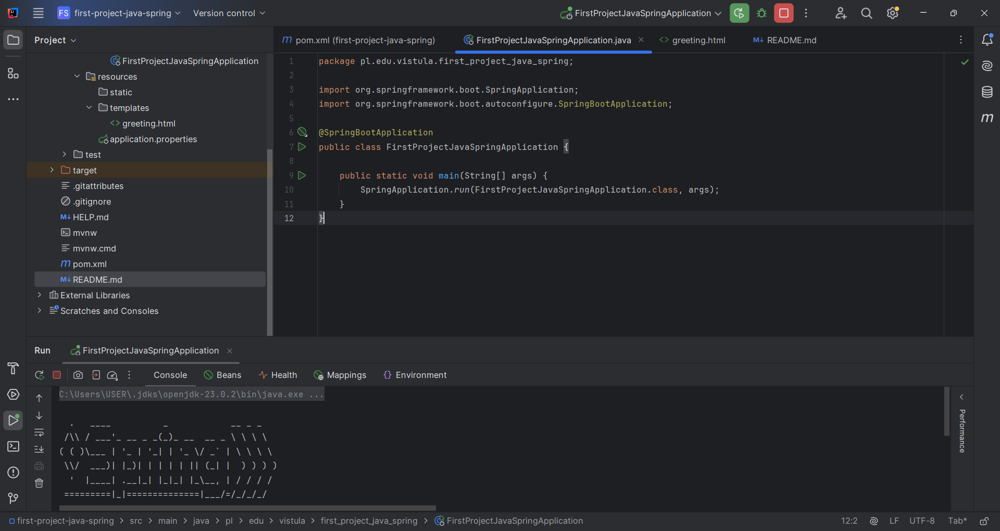

# Spring MVC Greeting App

This project is a simple Spring Boot MVC application created for the Java Labs course at Vistula University.

## ✅ Features
- Displays a greeting message using the `name` parameter from the URL
- Shows an image (`vistula.png`)
- Follows the MVC pattern using Thymeleaf templates

## 🚀 How to Run
1. Clone the repo:
   ```bash
   git clone https://github.com/your-username/spring-mvc-greeting-app.git
   ```
2. Open in IntelliJ as a Maven project.
3. Run `DemoApplication.java`.
4. Visit: `http://localhost:8080/greeting?name=HsHnb2O_

## 📸 Screenshots
### home OPRATION
![OPRATION Screenshot] 


###  Displayed name
![Image Screenshot] ! 

## 🛠 Tech Stack
- Java 17
- Spring Boot
- Spring MVC
- Thymeleaf
- Maven
